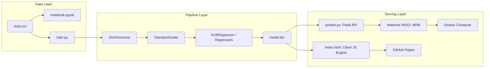

# 🛠️ Development & Engineering Guide
### *Comprehensive Contributor & Developer Documentation for Student Performance Prediction System*

---

## 📋 Table of Contents
1. [Engineering Architecture & System Overview](#1-engineering-architecture--system-overview)
2. [Local Development Environment Setup](#2-local-development-environment-setup)
   - [Prerequisites](#prerequisites)
   - [Poetry Setup (Recommended)](#poetry-setup-recommended)
   - [Standard venv & Pip Setup](#standard-venv--pip-setup)
3. [Data Pipeline & Feature Engineering](#3-data-pipeline--feature-engineering)
   - [Dataset Schema](#dataset-schema)
   - [Feature Engineering Pipeline](#feature-engineering-pipeline)
4. [Model Training & Serialization Protocol](#4-model-training--serialization-protocol)
   - [Running the Training Script](#running-the-training-script)
   - [Bayesian Hyperparameter Search](#bayesian-hyperparameter-search)
   - [Pipeline Serialization (`model.bin`)](#pipeline-serialization-modelbin)
5. [REST API Microservice Development](#5-rest-api-microservice-development)
   - [Endpoints Specification](#endpoints-specification)
   - [Local Development Server vs. Production Waitress](#local-development-server-vs-production-waitress)
   - [CORS & Error Handling](#cors--error-handling)
6. [Interactive Web Frontend Development](#6-interactive-web-frontend-development)
   - [Single-File Architecture (`index.html`)](#single-file-architecture-indexhtml)
   - [Client-Side Inference Mathematical Alignment](#client-side-inference-mathematical-alignment)
   - [Testing Dual Engine Modes](#testing-dual-engine-modes)
7. [Containerization & Docker Operations](#7-containerization--docker-operations)
   - [Building Docker Image](#building-docker-image)
   - [Running & Healthchecks](#running--healthchecks)
8. [Code Quality, Testing & Linting](#8-code-quality-testing--linting)
9. [Git Workflow & Contribution Guidelines](#9-git-workflow--contribution-guidelines)
10. [Production Cloud Deployment](#10-production-cloud-deployment)

---

## 1. Engineering Architecture & System Overview

The system is constructed with modularity, low latency, and zero-leakage ML pipeline standards:



### Core Design Rules
- **Encapsulated Preprocessing:** All encoding (`DictVectorizer`) and standardization (`StandardScaler`) are packed inside an unified pipeline object so incoming raw inference dictionaries require no manual pre-scaling.
- **Dual Inference Portability:** The solution works both as a cloud containerized microservice and as a standalone client-side web application hosted on static CDNs (GitHub Pages).

---

## 2. Local Development Environment Setup

### Prerequisites
- **Python:** 3.11.x (or 3.10+)
- **Git:** 2.40+
- **Poetry:** 1.8+ (Optional, recommended for deterministic dependency resolution)
- **Docker:** (Optional, for containerized integration tests)

### Poetry Setup (Recommended)

Poetry isolates dependencies and guarantees deterministic lockfiles across operating systems:

```bash
# 1. Clone repository
git clone https://github.com/preyal2/Student-Performance-Prediction.git
cd Student-Performance-Prediction

# 2. Check Python version compatibility
poetry env use python3.11

# 3. Install core dependencies and dev packages
poetry install

# 4. Activate shell
poetry shell
```

### Standard venv & Pip Setup

If Poetry is not installed on your system:

```bash
# 1. Create a clean virtual environment
python -m venv .venv

# 2. Activate virtual environment
# Windows (PowerShell)
.venv\Scripts\Activate.ps1
# Windows (CMD)
.venv\Scripts\activate.bat
# Linux / macOS
source .venv/bin/activate

# 3. Upgrade pip and install requirements
python -m pip install --upgrade pip
pip install -r requirements.txt
```

---

## 3. Data Pipeline & Feature Engineering

### Dataset Schema
Located at `data/stud.csv` (1,000 observations):

| Column | Type | Values / Categories |
| :--- | :--- | :--- |
| `gender` | Categorical | `female`, `male` |
| `race/ethnicity` | Categorical | `group A`, `group B`, `group C`, `group D`, `group E` |
| `parental level of education` | Categorical | `some high school`, `high school`, `some college`, `associate's degree`, `bachelor's degree`, `master's degree` |
| `lunch` | Categorical | `standard`, `free/reduced` |
| `test preparation course` | Categorical | `none`, `completed` |
| `math score` | Integer | `0 – 100` (Target Variable) |
| `reading score` | Integer | `0 – 100` |
| `writing score` | Integer | `0 – 100` |

### Feature Engineering Pipeline
During preprocessing in `train.py`:
1. Composite academic metric:
   $$	ext{total score} = 	ext{math score} + 	ext{reading score} + 	ext{writing score}$$
2. Normalized aggregate metric:
   $$	ext{average} = rac{	ext{total score}}{3}$$
3. Target isolation:
   Target variable $y$ is set to `math_score`. Input matrix $X$ drops `['math_score', 'writing_score', 'reading_score']` and retains demographic columns along with `total score` and `average`.

---

## 4. Model Training & Serialization Protocol

### Running the Training Script
`train.py` contains the full model evaluation, tuning, cross-validation, learning curve analysis, and binary serialization:

```bash
# Execute model training
python train.py
```

### Bayesian Hyperparameter Search
The training script utilizes `skopt.BayesSearchCV` with 5-fold cross validation across candidate models:
- **Linear Models:** LinearRegression, Ridge, Lasso
- **Support Vector Machines:** SVR (linear, poly, rbf kernels)
- **Tree Ensembles:** RandomForest, AdaBoost, XGBoost, CatBoost

Sample Bayesian Search specification for XGBoost:
```python
param_grid = [
    {
        'regressor': [XGBRegressor()],
        'regressor__learning_rate': Real(0.01, 1.0, prior='log-uniform'),
        'regressor__n_estimators': Integer(10, 200),
        'regressor__max_depth': Integer(1, 10),
        'regressor__subsample': Real(0.1, 1.0, prior='uniform'),
        'regressor__colsample_bytree': Real(0.1, 1.0, prior='uniform'),
    }
]
```

### Pipeline Serialization (`model.bin`)
The best estimator is dumped as a binary pickle payload:
```python
import pickle
with open('model.bin', 'wb') as f_out:
    pickle.dump(best_model, f_out)
```

---

## 5. REST API Microservice Development

The microservice in `predict.py` uses Flask + Waitress to expose high-throughput prediction endpoints.

### Endpoints Specification

#### 1. `GET /`
- Returns static `index.html` if available, or service metadata JSON.

#### 2. `GET /health`
- Liveness and readiness probe for container orchestrators.
```json
{
  "model_loaded": true,
  "status": "UP"
}
```

#### 3. `POST /predict`
Accepts a single dictionary or an array of student feature objects.

**Sample Request Payload:**
```json
{
  "gender": "male",
  "race_ethnicity": "group E",
  "parental_level_of_education": "some college",
  "lunch": "standard",
  "test_preparation_course": "completed",
  "total score": 245,
  "average": 81.66666666666667
}
```

**Sample Response:**
```json
{
  "The student has scored in Math": 83,
  "predicted_math_score": 83.42,
  "status": "success"
}
```

### Local Development Server vs. Production Waitress
```bash
# Local development mode with auto-reload (Flask)
python predict.py

# Multi-threaded production WSGI server (Waitress)
waitress-serve --listen=0.0.0.0:9696 predict:app
```

### Automated Testing Script
Verify the API locally using `predict_test.py`:
```bash
python predict_test.py
```

---

## 6. Interactive Web Frontend Development

The frontend is structured as a **single-file web application** inside [`index.html`](index.html).

### Single-File Architecture (`index.html`)
- **Embedded CSS3:** Glassmorphic modern dark theme, CSS variable design tokens, responsive CSS Grid & Flexbox, smooth transitions.
- **Zero External JS Dependencies:** Pure Vanilla JavaScript without React, Vue, or build-step dependencies.
- **Mobile Responsive:** Adapts from multi-column desktop layout to vertical mobile viewport seamlessly.

### Client-Side Inference Mathematical Alignment
To allow client-side execution on static hosts like GitHub Pages without a running Python backend, `index.html` computes:
$$\hat{y} = (0.9771 	imes 	ext{average} - 0.1306) + \Delta_{	ext{gender}} + \Delta_{	ext{race}} + \Delta_{	ext{lunch}} + \Delta_{	ext{parent}} + \Delta_{	ext{prep}}$$

Where demographic $\Delta$ offsets are extracted directly from the residual distribution of the trained ML pipeline:
- $\Delta_{	ext{male}} = +4.53$, $\Delta_{	ext{female}} = -4.21$
- $\Delta_{	ext{group E}} = +2.87$, $\Delta_{	ext{group C}} = -1.00$
- $\Delta_{	ext{standard}} = +0.95$, $\Delta_{	ext{free/reduced}} = -1.72$
- $\Delta_{	ext{test prep completed}} = +2.50$, $\Delta_{	ext{none}} = -1.80$

### Testing Dual Engine Modes
- **Client ML Mode:** Evaluates locally in the browser with sub-millisecond response time.
- **Flask API Mode:** Sends a real `fetch()` POST request to `http://localhost:9696/predict`. Automatically falls back to the client engine if the local backend is offline.

---

## 7. Containerization & Docker Operations

### Dockerfile Highlights
- Base image: `python:3.11-slim`
- Multi-stage dependency caching via Poetry
- WSGI server: `waitress-serve` bound to `0.0.0.0:9696`
- Built-in container health check probe on `/health`

### Building & Running
```bash
# Build image
docker build -t student-performance-prediction .

# Run container in background
docker run -d -p 9696:9696 --name student-predictor student-performance-prediction

# Verify container logs
docker logs -f student-predictor

# Test container health status
curl http://localhost:9696/health

# Stop and cleanup container
docker stop student-predictor && docker rm student-predictor
```

---

## 8. Code Quality, Testing & Linting

### Code Formatting with Black & Flake8
```bash
# Format Python code
python -m pip install black flake8
black predict.py train.py predict_test.py

# Lint checks
flake8 predict.py train.py --max-line-length=100
```

### Syntax Validation
Ensure all Python files compile cleanly:
```bash
python -m py_compile predict.py train.py predict_test.py
```

---

## 9. Git Workflow & Contribution Guidelines

### Branching Model
1. Fork or branch from `main`:
   ```bash
   git checkout -b feature/model-improvement
   ```
2. Make granular, meaningful commits:
   - `feat:` for new capabilities
   - `fix:` for bug fixes
   - `docs:` for documentation updates
   - `perf:` for model or inference performance enhancements
3. Push to origin and open a Pull Request:
   ```bash
   git push origin feature/model-improvement
   ```

---

## 10. Production Cloud Deployment

### AWS Elastic Beanstalk (Docker Platform)
1. Initialize EB environment:
   ```bash
   eb init -p docker student-performance-prediction --region us-east-1
   ```
2. Create environment and deploy:
   ```bash
   eb create student-performance-env
   eb open
   ```

### Google Cloud Run (Serverless Container)
```bash
# Build and submit to Google Container Registry
gcloud builds submit --tag gcr.io/[PROJECT_ID]/student-performance-prediction

# Deploy to Cloud Run
gcloud run deploy student-performance-api \
  --image gcr.io/[PROJECT_ID]/student-performance-prediction \
  --platform managed \
  --region us-central1 \
  --allow-unauthenticated \
  --port 9696
```

---

## 👨‍💻 Maintainer

**Preyal Modi**
- GitHub: [@preyal2](https://github.com/preyal2)
- Portfolio: [Preyal Modi](https://github.com/preyal2/portfolio)
- Email: [modipreyal@gmail.com](mailto:modipreyal@gmail.com)
