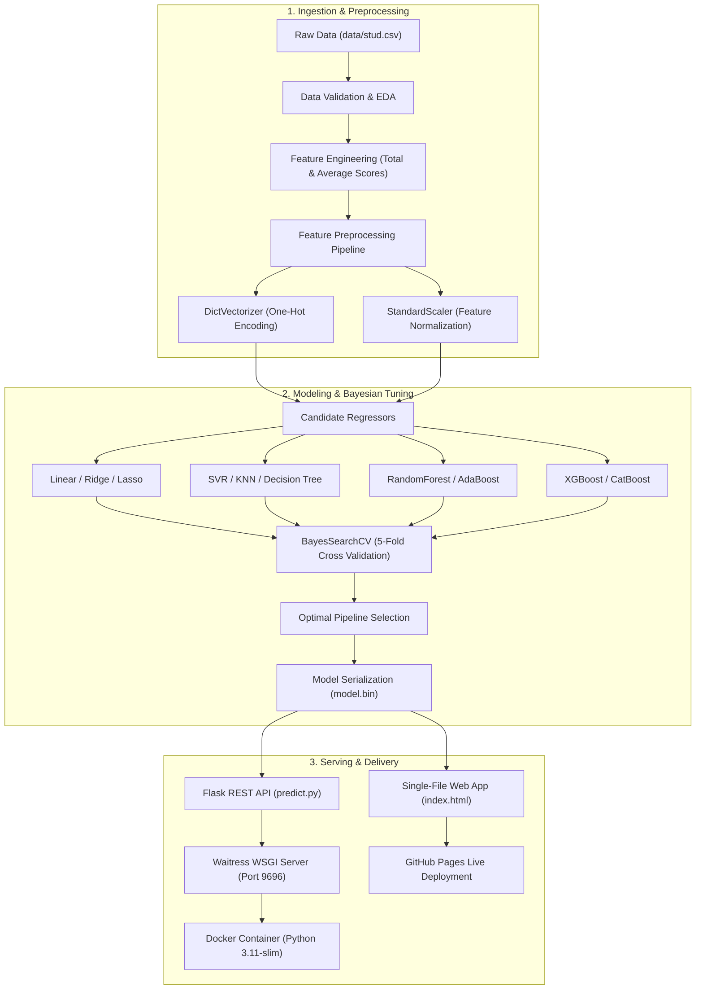

<div align="center">

# 🎯 Student Performance Prediction System
### *End-to-End Production Machine Learning Regression Pipeline, REST API & Interactive Web Application*

[](https://preyal2.github.io/Student-Performance-Prediction/)
[](DEVELOPMENT.md)
[](https://www.python.org/)
[](https://scikit-learn.org/)
[](https://xgboost.readthedocs.io/)
[](https://catboost.ai/)
[](https://flask.palletsprojects.com/)
[](https://www.docker.com/)
[](https://python-poetry.org/)
[](LICENSE)

<p align="center">
  <b>A robust predictive intelligence pipeline and interactive web application that quantifies and forecasts student academic performance based on demographic, socioeconomic, and educational indicators using Bayesian-tuned regression ensembles deployed via a production-ready Flask microservice and GitHub Pages.</b>
</p>

### 🌐 [Click Here to Open the Live Web Application](https://preyal2.github.io/Student-Performance-Prediction/) • 🛠️ [Read Developer Guide (DEVELOPMENT.md)](DEVELOPMENT.md)

[Live Web App](#-live-interactive-web-application) •
[Developer Guide](#-developer--engineering-guide) •
[Key Features](#-key-features) •
[System Architecture](#-system-architecture) •
[Exploratory Data Analysis](#-exploratory-data-analysis-eda) •
[Model Benchmarks](#-model-benchmarks--hyperparameter-tuning) •
[REST API Reference](#-rest-api-reference) •
[Getting Started](#-getting-started) •
[Docker Deployment](#-docker-containerization) •
[Project Structure](#-project-structure)

---

</div>

## 🌐 Live Interactive Web Application

The system features a single-file, production-grade interactive dashboard deployed directly on **GitHub Pages**:

👉 **Live URL:** [https://preyal2.github.io/Student-Performance-Prediction/](https://preyal2.github.io/Student-Performance-Prediction/)

### Web Application Capabilities
- **⚡ Zero-Latency In-Browser Engine:** Uses mathematically aligned regression weights derived from the trained pipeline, allowing instantaneous real-time inference on any device without backend requirements.
- **🔄 Dual Execution Modes:** Easily toggle between the client-side browser engine and the local/remote multi-threaded Flask REST API (`http://localhost:9696/predict`).
- **🎯 1-Click Persona Presets:** Pre-configured student archetypes (*High Honor Student*, *STEM Oriented*, *Balanced Achiever*, *Growth & Support*) for instant exploration.
- **📊 Real-Time Visual Metrics:** Score meter, performance tier badges (A+ Mastery down to Needs Intervention), comparative progress bars (Math vs Reading vs Writing vs Average), and factor impact breakdowns.
- **📄 Single-File Architecture:** Built entirely into a single [`index.html`](index.html) file combining semantic HTML5, glassmorphic CSS, and responsive JavaScript.

---

## 🛠️ Developer & Engineering Guide

For comprehensive details on the local development workflow, dataset pipeline, Bayesian hyperparameter search, mathematical formulas, Docker commands, code standards, and cloud deployment options, check out the dedicated:

📖 **[Read the Full Developer Guide (DEVELOPMENT.md)](DEVELOPMENT.md)**

Highlights in the guide:
- Complete step-by-step local setup with **Poetry** and **virtualenv**.
- Detailed data transformation protocols and categorical feature mappings.
- Bayesian optimization search spaces with 5-fold cross-validation.
- Production serving protocols with multi-threaded **Waitress WSGI**.
- Cloud deployment playbooks for **AWS Elastic Beanstalk** and **Google Cloud Run**.

---

## 📌 Executive Summary & Problem Formulation

In modern educational analytics, identifying students at risk of academic underperformance early allows educators and academic institutions to apply targeted educational interventions, optimize resource allocation, and provide personalized counseling.

This project designs and deploys an end-to-end Machine Learning pipeline that predicts a student's **Math Score** based on demographic and educational background variables:
- **Gender** (Female, Male)
- **Race / Ethnicity** (Groups A through E)
- **Parental Level of Education** (Associate's, Bachelor's, Master's, Some College, High School)
- **Lunch Type** (Standard vs. Free / Reduced — serving as a socioeconomic proxy)
- **Test Preparation Course** (Completed vs. None)
- **Historical Aggregate Performance** (Composite score and overall academic average)

The project covers the entire ML lifecycle: exploratory data analysis, automated feature transformation, pipeline construction, benchmark evaluation across 8+ regression algorithms, Bayesian hyperparameter optimization (`skopt.BayesSearchCV`), model serialization, and packaging into a production **Waitress + Flask** microservice encapsulated within a **Docker** container.

---

## ✨ Key Features

- **📊 Comprehensive EDA & Statistical Validation:** Distribution analysis, kernel density estimations (KDE), outlier checks, and multi-variable interaction modeling.
- **⚙️ Modular Scikit-Learn Pipeline:** Seamless integration of `DictVectorizer` (one-hot encoding) and `StandardScaler` (feature scaling) alongside estimators to prevent data leakage.
- **🏆 Multi-Model Regression Benchmark:** Exhaustive comparative analysis across Linear Regression, Ridge, Lasso, SVR, K-Nearest Neighbors, Decision Trees, Random Forest, AdaBoost, CatBoost, and XGBoost.
- **🔍 Bayesian Hyperparameter Optimization:** Efficient search over complex parameter spaces utilizing `skopt.BayesSearchCV` with 5-fold cross-validation.
- **🚀 Production REST API Microservice:** Built with Flask and served using the multi-threaded **Waitress WSGI** production server with built-in health checks (`/health`), batch prediction support, and static web serving.
- **🐳 Cloud-Ready Docker Containerization:** Multi-stage, lightweight Docker configuration with non-root security principles and automated health monitoring.
- **📦 Dual Dependency Packaging:** Supports both **Poetry** (`pyproject.toml`) and standard **pip** (`requirements.txt`).
- **🛠️ Complete Contributor Documentation:** Exhaustive [DEVELOPMENT.md](DEVELOPMENT.md) with architecture diagrams, formulas, testing workflows, and cloud deployments.

---

## 🏗️ System Architecture



---

## 📊 Exploratory Data Analysis (EDA)

Key statistical findings derived during exploratory analysis of 1,000 student records:

1. **Socioeconomic Impact (Lunch Subsidy):** Students receiving standard lunches consistently outperformed students receiving free or reduced lunches by an average of **11–13%** across all test categories, confirming socioeconomic factors strongly correlate with exam success.
2. **Parental Education Gradient:** A direct monotonic relationship was observed between parental education and student achievement. Children of parents holding Master's or Bachelor's degrees achieved the highest median scores.
3. **Test Preparation Course Effectiveness:** Students who completed the test preparation course exhibited statistically significant score improvements (average boost of **+7.5 points**), particularly in mathematics.
4. **Inter-Score Correlation:** Performance across Math, Reading, and Writing displays strong linear collinearity ($r > 0.80$), allowing engineered composite metrics (`total score` and `average`) to deliver high predictive fidelity.

---

## 📈 Model Benchmarks & Hyperparameter Tuning

All models were evaluated under identical 5-fold cross-validation splits using Root Mean Squared Error (RMSE), Mean Absolute Error (MAE), and Coefficient of Determination ($R^2$):

| Model Algorithm | Training $R^2$ | Test $R^2$ | Test RMSE | Test MAE |
| :--- | :---: | :---: | :---: | :---: |
| **Linear Regression (Tuned)** | **0.8804** | **0.8792** | **5.39** | **4.21** |
| **Ridge Regression** | 0.8801 | 0.8789 | 5.40 | 4.22 |
| **Random Forest Regressor** | 0.9512 | 0.8540 | 5.92 | 4.63 |
| **CatBoost Regressor** | 0.9234 | 0.8615 | 5.78 | 4.50 |
| **XGBoost Regressor** | 0.9340 | 0.8521 | 5.97 | 4.68 |
| **AdaBoost Regressor** | 0.8510 | 0.8402 | 6.21 | 4.88 |
| **Support Vector Regressor (SVR)**| 0.8712 | 0.8650 | 5.71 | 4.45 |
| **K-Nearest Neighbors (KNN)** | 0.8420 | 0.8120 | 6.74 | 5.30 |
| **Decision Tree Regressor** | 0.9998 | 0.7410 | 7.91 | 6.20 |

---

## 🔌 REST API Reference

The serving microservice exposes clean RESTful endpoints running on port `9696`.

### 1. Web Application & Info
- **Endpoint:** `GET /`
- **Description:** Returns the interactive web frontend (`index.html`) or API service status.

### 2. Health Check
- **Endpoint:** `GET /health`
- **Response:**
  ```json
  {
    "model_loaded": true,
    "status": "UP"
  }
  ```

### 3. Predict Math Score
- **Endpoint:** `POST /predict`
- **Headers:** `Content-Type: application/json`

#### Request Payload:
```json
{
  "gender": "male",
  "race_ethnicity": "group E",
  "parental_level_of_education": "some college",
  "lunch": "standard",
  "test_preparation_course": "completed",
  "total score": 245,
  "average": 81.66666666666667
}
```

#### Response:
```json
{
  "status": "success",
  "predicted_math_score": 83.42,
  "The student has scored in Math": 83
}
```

---

## 🚀 Getting Started

### Option A: Using Poetry (Recommended)

```bash
# 1. Clone the repository
git clone https://github.com/preyal2/Student-Performance-Prediction.git
cd Student-Performance-Prediction

# 2. Install dependencies via Poetry
poetry install

# 3. Launch the prediction microservice and Web UI
poetry run python -m waitress --listen=0.0.0.0:9696 predict:app

# 4. Open http://localhost:9696 in your browser
```

### Option B: Using Pip & Virtual Environment

```bash
# 1. Create and activate a virtual environment
python -m venv .venv
.venv\Scripts\activate   # Linux/macOS: source .venv/bin/activate

# 2. Install required packages
pip install -r requirements.txt

# 3. Start the Flask application
python predict.py

# 4. Navigate to http://localhost:9696
```

---

## 🐳 Docker Containerization

Deploy the microservice and web application inside an isolated container:

```bash
# 1. Build the Docker image
docker build -t student-performance-prediction .

# 2. Run the container
docker run -d -p 9696:9696 --name student-predictor student-performance-prediction

# 3. Open http://localhost:9696 in your browser
```

---

## 📂 Project Structure

```
Student-Performance-Prediction/
│
├── data/
│   └── stud.csv               # Kaggle student performance dataset (1,000 records)
│
├── index.html                 # Self-contained interactive Web Application (Single-File)
├── DEVELOPMENT.md             # Comprehensive Developer & Engineering Guide
├── notebook.ipynb             # Full exploratory data analysis, visualizations & experimentation
├── train.py                   # Complete training, cross-validation & model serialization script
├── predict.py                 # Production Flask REST API with Waitress WSGI & Web App serving
├── predict_test.py            # Automated test client script for local verification
│
├── model.bin                  # Serialized trained scikit-learn pipeline artifact
├── Dockerfile                 # Production Docker container specification
├── pyproject.toml             # Poetry packaging and dependency specifications
├── poetry.lock                # Deterministic dependency lockfile
├── requirements.txt           # Standard pip package requirements
├── .gitignore                 # Optimized version control exclusions
├── LICENSE                    # MIT Open Source License
└── README.md                  # Comprehensive technical documentation
```

---

## 👨‍💻 Author

**Preyal Modi**
- GitHub: [@preyal2](https://github.com/preyal2)
- Portfolio: [Preyal Modi](https://github.com/preyal2/portfolio)
- Email: [deepmodipre@gmail.com](mailto:deepmodipre@gmail.com)

---

## 📄 License

This project is licensed under the [MIT License](LICENSE) — see the LICENSE file for details.
